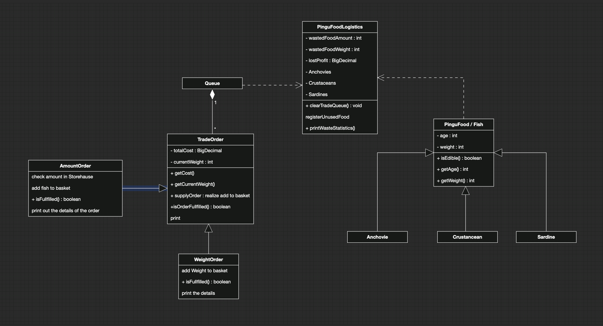

# PGdP

1. It is a program simulation for a food-selling system. 
2. The main function is the FoodLogistics function responsible for managing the order queue. 
3. There is a PinguFood class that describes different types of food. 
4. Multiple Mr. Penguin customers (assumed) will place orders, 
5. and the software will automatically add the new orders to the existing order queue and process them.
